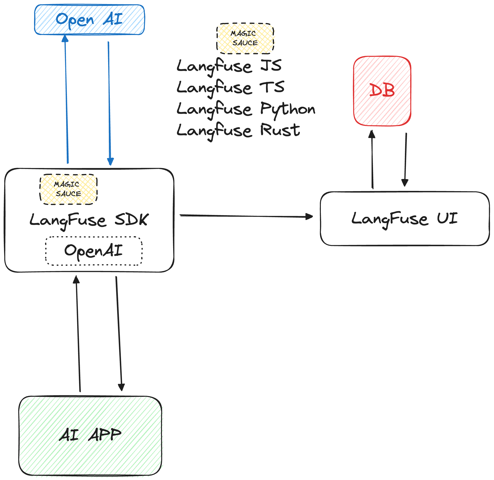
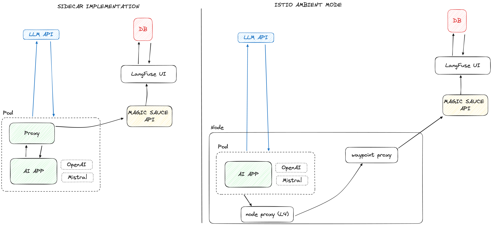

# Episode 15: Model and LLM observability with Langfuse

YouTube: [TBD](https://www.youtube.com/watch?v=IM1VzKDI9SI)

References:

- [Langfuse](https://langfuse.com)
- [trulens](https://trulens.org)
- [deepchecks](https://deepchecks.com/)
- [OpenLLMetry](https://www.traceloop.com/openllmetry)

## Langfuse

You can self-host Langfuse and run it using Docker or inside Kubernetes. It consists of a database and a frontend with the API.

There are language specific SDKs available and act as a wrapper around the LLM API. For example, in the video I looked at the Langfuse Python SDK and used the Open AI API wrapped version.

This wrapper has the same interface as the Open AI API, with the added "magic sauce" of extracting the data from the HTTP requests that are sent (and received) from the Open AI API. The data from these requests is then sent to the frontend API where it gets stored in the database and displayed in the UI.

## Ideas for improving the architecture

Right now all magic sauce is stored in the language SDKs which can be a pain to maintain (for Langfuse) as well as for the users of the SDKs. With every new LLM API version, the SDKs need to be updated, which means the users have to update and rebuild their AI applications to use the latest version of the SDK.

One of the ideas on how to improve this is to use the so-called sidecar pattern (made popular by the service meshes). In this model the magic sauce is either part of the sidecar proxy OR a separate service that is called by the sidecar proxy. This way the magic sauce can be updated independently of the AI application and the LLM API.

